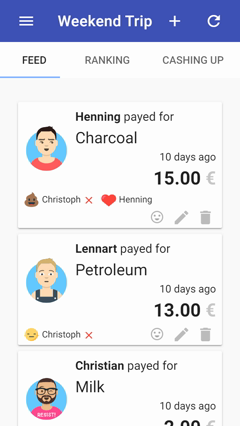
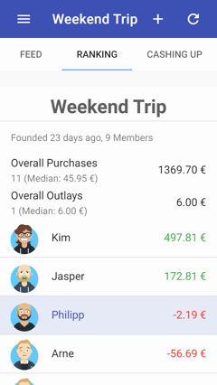

# Payshare

A web app to track shared expenses in a group of people.

Payshare is the equivalent of a whiteboard in the kitchen of your shared
flat where everyone writes down how much he paid for groceries, who paid
the cinema ticket or pizza for whom and so on, while it does the math
for you to figure out who should buy the next round.

## Screenshots

 

 

## Setup

Individual Steps: **TBD**

The project currently relies on the Django admin pages to create new
Collectives and Users and add Memberships between them. You can assign
an avatar for each user. There are many avatar generators, I like these:
- https://getavataaars.com/
- http://avatars.adorable.io/
- https://robohash.org/

## A Note about Security

The whiteboard metaphor still holds here: Anyone with a key to yor flat
(aka password for the Collective) can create and delete content or
impersonate other Users. It's all based on trust between the people in
the group.

## Terminology
- `Collective`: This is basically your shared flat, sports team, whatever
- `User`: A person that can be a member of one or more Collectives
- `Membership`: The connection of a User to a Collective

## Tech Stack

Project is build with Django 2.1, Vue 2.5, vue-cli-3 and Vuetify 1.1.0.
Technically it is a PWA, but right now that is only used to cache the
app shell, not any API responses.

## Deployment

Oh, the joy of deploying custom web apps to your own server. Our backend
will be setup as a systemd service that runs a WSGI app via gunicorn,
whereas the frontend is built into a bundle of static files that our
webserver can serve as is. We'll use nginx here to illustrate a possible
configuration.

Notes: We should use https in any case, but it is also a requirement
  for the service-worker. One specialty about location blocks here
  is that for some we'll want to pass through the URL path and for
  others we don't.
